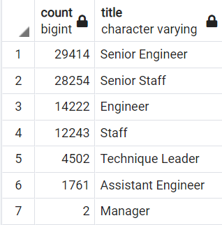

# Pewlett-Hackard-Analysis

## Overview of Analysis
Analying the employee data to create meaningful data use by the company. 
Using the exsiting data to determine the number of employees retiring and how to utilize the sorce for mentoring program by their department and job title

---

## Results

### Analysis of Outcomes Based on Retiring Titls 

- Employees retiring: 29,414 senior engineers, 28,254 senior staff members, 14,222 engineers, 12,243 staff members, 4,502 technique leaders, 1,761 assistant engineers, and 2 managers

- from the summary above, it states that company will loose a large number of (50K+) senior and staff level of employee from retirement, company need think of how we can fill retain/slowly transitioning the retirmenet and back fill those positions

### Analysis of Outcomes Based on Mentoring Program Titls

- Employees eligible for the mentorship program : 1549 current employees born in 1965.
- from the analysis, the employee are eligible for the mentioning program that can fill in those retired employees are less than 5% of the numbers that are retiriing. especially in the experienced positions. these might cause huge shorthand for those roles in the company

## Summary
with the loosing of a large number of employees that soon be retired, and not enough people to back fill those position, company need to create more incentive programs to attact talent from the job market as well as training/mentoring the current employees to be ready to fill in those positions 
